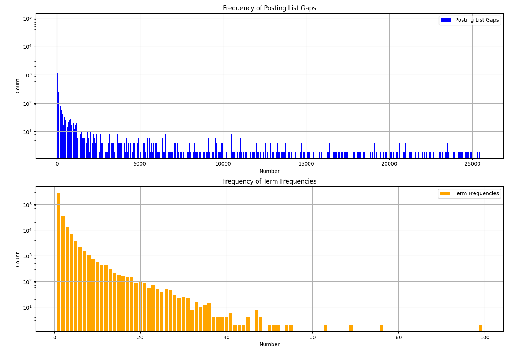

# in4120 - posting list compression

The original assignment used variable byte encoding, which means all numbers will be compressed using multiples of 8 bits for its compression. I wanted to implement `EliasGammaEncoding` first, but because Python mainly works at the byte-level and not the bit-level, I figured I would convert the upstream implementation from using `bytearray` to `bitarray` just for consistency between my encoding and decoding calls.

After having converted the original encoding implementation, I decided to take a look at the values we were storing. To do this, I made one file for the gaps, and one file for the term frequencies we were storing. Each posting list was appended as a new line in the file. This proved useful, since I quickly realized most gaps had either a value of exactly 1, or a value which was more often than not in the 5000-10000 range. The term frequencies mostly had low values, most of them 1, but the rest were generally quite low numbers.

My naïve approach to solve this was to use the Variable Byte Encoding for the gaps, and my Elias-Gamma Encoding for the term frequencies.

While I was expecting a drastic change in the allocated space on the stack, I didn't see any change in the compression ratio. I then decided to add a bunch of fake bits (1024 per encoded value) to both the encodings, and nothing changed either. I believe this is due to how python allocates memory at harmonic intervals, and I wouldn't see a difference until I hit some specific threshold. To solve this I decided to count the `bitlength` of the posting lists during the finalization of the inverted index instead, and compare the values here instead. I still want to understand the specifics of the stack allocator statistics, though.

After handling the measurements, I did see a change in the compression, going from a scary 2.01M bits (using only VBC) to a measly 1.39M bits (using VBC for the gaps, and EGC for the term frequencies). Using only Elias-Gamma (having to off-by-one the gaps since some of them are 0), we actually go down to 1.34M, which surprised me. After further testing, I realized this is actually a gamble. After summing up all the sizes across tests, it turns out that the combination of both tends to be better, as I expected.

Finally, I implemented my own algorithm, which I decided to call `OneshotCodec`, which essentially is a wrapper around `VariableByteCodec`. This codec works best when most values are 1 (like they are in our gaps), and work reasonably similar to variable byte encoding otherwise. They will use an additional 0-bit as a prefix before offloading the encoding/decoding to `VariableByteCodec`. Using this, we go from 2.01M bits (4.30M across all tests) in the original code, down to 1.29M bits (2.79M across all tests). I would argue that's quite the improvement!

